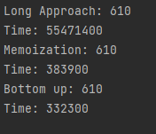
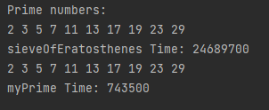

# Dynamic Programming

Dynamic programming is an **algorithmic technique** that aims to optimize recursion codes. We do this optimization by storing results of previous problems and use it when we need.
 
### Those are the comparisons among tecniques' execution times:

  

